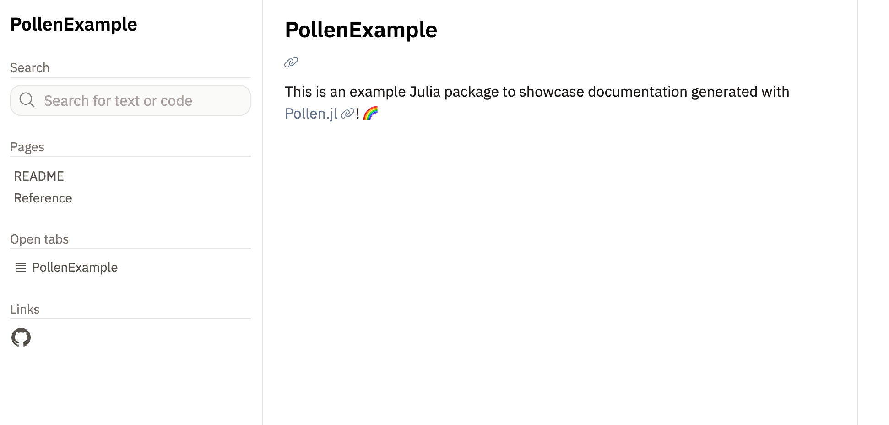

# Creating, writing and publishing package documentation

This tutorial will teach you how to create a new Julia package with Pollen.jl documentation to get a site just like the one you are probably reading this on. After reading this, you will have learned how to

- create a Julia package and set up Pollen as its documentation system,
- use Pollen's development server with live reload to preview changes as you make them; and
- how to publish the package documentation to GitHub Pages

You can see the resulting project and its documentation at [lorenzoh/PollenExample.jl](https://github.com/lorenzoh/PollenExample.jl).

!!! warn "Installation"

    Before starting the tutorial, make sure you've followed the [installation instructions for Pollen.jl](../howto/install.md).

### Create a repository on GitHub

First, go to [github.com/new](https://github.com/new) and create a repository.

Then, [clone the repository](https://docs.github.com/en/repositories/creating-and-managing-repositories/cloning-a-repository) to your local machine. You can do this from a Julia REPL:

```julia
using Pkg: devdir
user = "GITHUB_USER"
pkgname = "PollenExample.jl"
run(`git clone https://github.com/$(user)/$(pkgname) $(devdir())/$(pkgname)`)
```

## Setting up documentation

!!! note "Documentation for an existing package"

    This section describes how to add Pollen documentation when creating a new package. If you want to add Pollen.jl documentation to an existing package, see [How to setup package documentation](/doc/docs/howto/setup.md).

A handy tool for creating new Julia packages is [PkgTemplates.jl](https://github.com/invenia/PkgTemplates.jl). Pollen.jl provides a plugin for PkgTemplates.jl to spare you arduous manual setup.

Install `PkgTemplates.jl` and create a template that includes [`Pollen.PollenPlugin`](#), substituting the `user` for your own GitHub user name:

```julia
using PkgTemplates, Pollen

template = Template(plugins=[
        Pollen.PollenPlugin(),
        Tests(project=true),
        Git(ssh=true),
        GitHubActions(),
        Develop(),
        ProjectFile(),
    ],
    user="lorenzoh", julia=v"1.8")
```

Next, we'll instantiate the template by calling it with the name of the package we want to create:

```julia
template(joinpath(devdir(), pkgname))
```

Once this is done, you'll have a brand new package ready to use Pollen.jl's documentation system!

## Writing documentation interactively

Now, we'll work on the documentation and preview it locally.  Run the preview server with live reload using [`Pollen.servedocs`](#):

```julia
using PollenExample
servedocs(PollenExample)
```

Once you see messages that two servers are running on ports 5173 and 8000, open [localhost:5173](http://localhost:5173) for the preview. The first time we run this, Pollen has to install the frontend, but subsequent runs will be much faster. The opened page should look like this:


The landing page shows our package's `README.md` which, of course, is almost empty! Let's keep the server running and edit the file, for example by adding some text under the heading. Save the file, return to the documentation web page and press **`Shift+R`**. The 
page should update with the text you added to the README. For example:



Great job! We just updated part of the documentation. While there are a lot more things we could change about the docs at this point, we'll leave them for another tutorial and get to the last part in this tutorial: publishing our package's documentation as a website.

## Publishing the documentation on GitHub Pages

If you used the template from the first part of this tutorial, the package directory will already be a git repository. First, we need to make sure to commit the changes we made above:

```sh
> cd ~/.julia/dev/PollenExample
> git add .
> git commit -m "Modified README"
> git push
```

That's it! After about 10 minutes, you'll have a documentation page built at `$user.github.io/PollenExample.jl`.

Now, every time you push changes to your package's `main` branch, the documentation page will be updated!