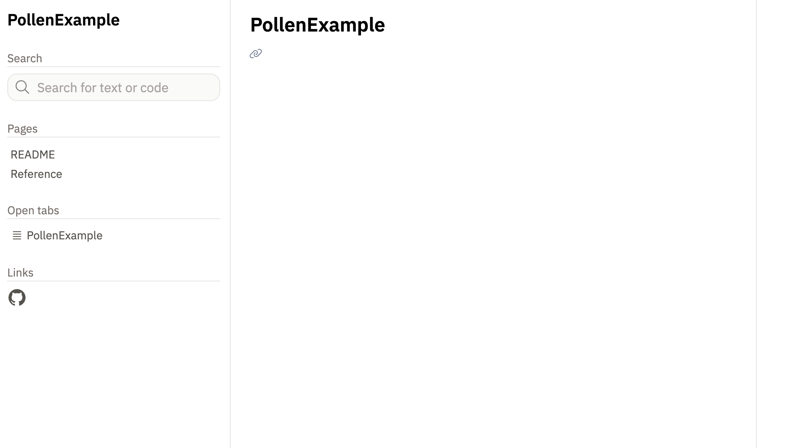

# Creating, writing and publishing package documentation

This tutorial will teach you how to create a new Julia package with Pollen.jl documentation to get a site just like the one you are probably reading this on. After reading this, you will have learned how to

- create a Julia package and set up Pollen as its documentation system,
- use Pollen's development server with live reload to preview changes as you make them; and
- how to publish the package documentation to GitHub Pages

You can see the resulting project and its documentation at [lorenzoh/PollenExample.jl](https://github.com/lorenzoh/PollenExample.jl).

!!! warn "Installation"

    Before starting the tutorial, make sure you've followed the [installation instructions for Pollen.jl](../howto/install.md).


## Creating a package with Pollen.jl documentation

!!! note "Documentation for an existing package"

    This section describes how to add Pollen documentation when creating a new package. It is also possible to add Pollen.jl documentation to an existing package [as described here](/documents/docs/howto/setup.md).

The most commonly used tool for creating new Julia packages is [PkgTemplates.jl](https://github.com/invenia/PkgTemplates.jl). Pollen.jl provides a plugin for PkgTemplates.jl to spare you any arduous setup tasks.

To create a template, make sure you have `PkgTemplates` installed and create a template with the Pollen plugin:
```julia
using PkgTemplates, Pollen

template = Template(plugins=[
        Pollen.PollenPlugin(),
        Tests(project=true),
        Git(ssh=true),
        GitHubActions(),
        Develop(),
        ProjectFile(),
    ],
    user="lorenzoh", julia=v"1.6")
```

!!! note "Following along"
    If you want to follow along and host the tutorial project on GitHub pages, make sure to replace `"lorenzoh"` with your GitHub user name. 
    
Next, we'll instantiate the template by calling it with the name of the package we want to create:

```julia
template("PollenExample")
```

Once this is done, you'll have a brand new package ready to use Pollen.jl's documentation system.

## Writing documentation interactively

Now, we'll work on the documentation and preview it locally. The package files were generated in Julia's package development directory:

{cell}
```julia
using Pkg
dir = joinpath(Pkg.devdir(), "PollenExample")
```

We'll activate the package's documentation environment so that we can load the created package and Pollen itself, and then start the documentation development server:

```julia
using Pkg; Pkg.activate(joinpath(dir, "docs"))
include(joinpath(dir, "docs/serve.jl"))
```

Once you see messages that two servers are running on ports 3000 and 8000, you can click the first link ([http://localhost:3000/dev/i](http://localhost:3000/dev/i)) to see a preview of the documentation. The first time, we run this, Pollen has to install the frontend, but subsequent runs will be much faster. The opened page should look like this:



The landing page shows our package's `README.md` which, of course, is almost empty! Let's keep the server running and edit the file, for example by adding some text under the heading. Save the file, return to the documentation web page and **press `R`**. The 
page should update with the text you added to the README. For example:


Great job! We just updated part of the documentation. While there are a lot more things we could change about the docs at this point, we'll leave them for another tutorial and get to the last part in this tutorial: publishing our package's documentation as a website.

## Publishing the documentation on GitHub Pages

If you used the template from the first part of this tutorial, the package directory will already be a git repository. First, we need to make sure to commit the changes we made above:

```sh
> cd ~/.julia/dev/PollenExample
> git add .
> git commit -m "Modified README"
```

Now, you'll need to create a GitHub repository at `/$username/PollenExample.jl`. If you used your GitHub user in the template above, the local repository's remote should be set up correctly. Now we'll push our changes, and also two helper branches that Pollen uses to host a page:

```sh
> git checkout pollen && git push --set-upstream origin main
> git checkout gh-pages && git push --set-upstream origin main
> git checkout main && git push --set-upstream origin main
```

That's it! After about 10 minutes, you'll have a documentation page built at `$username.github.io/PollenExample.jl/dev/i`.

Now, every time you push changes to your package's `main` branch, the documentation page will be updated!

---

Now that we've built a workflow for publishing documentation, it's time to find out how you to organize your documentation! (follow-up tutorial coming soon 👀)